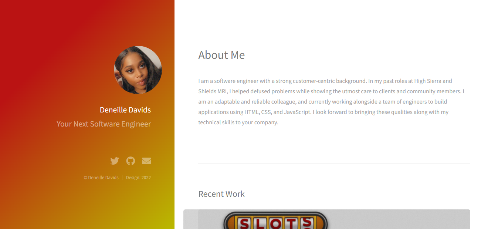

# My Portfolio Project
This project highlights my dev journey by showcasing my work in order of my most recent. I wanted to display a very minimilistic project; with everything organized and easy to find.

**Link to project: https://ddavids.netlify.app/** 

## How It's Made:

**Tech used:** HTML, CSS, JavaScript

I utilized my skills in javaScript, HTML and CSS to truly capture what I believe is an inviting, simple and direct portfolio. I personalized this semantically to display my recent work in order of user usability. 

## Lessons Learned:
I learned to push my projects to GitHub, and did so that the updates made on my computer would update on my wesbite link as well.I learned to drop files into netlifly to generatte a wesbite to share and have access to on all browsers. 
